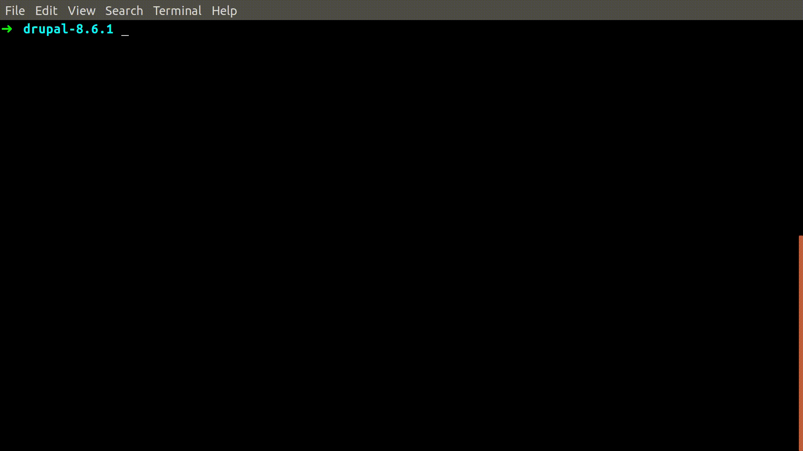

MySQL Plugin for VIM
======================

[Pathogen](https://github.com/tpope/vim-pathogen) compatible plugin module that allows to execute SQL statements in VIM,
while managing database connection configuration files.

What this Plugin will do
-------------------------

It will allow you to open/create a `*.sql` file, type sql commands in it, and
run those commands through the already installed `mysqlclient` program.  The
results will then display on a different window/buffer for you to manipulate as
a completelly normal text file.



What you need (dependencies)
----------------------------

- mysql client already installed.
- [Pathogen](https://github.com/tpope/vim-pathogen) plugin for VIM installed.

That's it!

Maturity
----------

Please check the VERSION file for current maturity. I try to adhere to a semantic versioning system:

```
1.2.0
| | |
| | --- Bug fixes and other.
| ----- New functionality added, backwards compatible.
------- Mayor release, no backwards compatibility warranteed.
```

If the mayor release is 0, the project is still in development - it can be used, but it still undergoing mayor updates.

Master branch has the most stable release.

Todo
---------
- Add comprehansive documentation
- Add examples
- Add shortcuts and snippets

